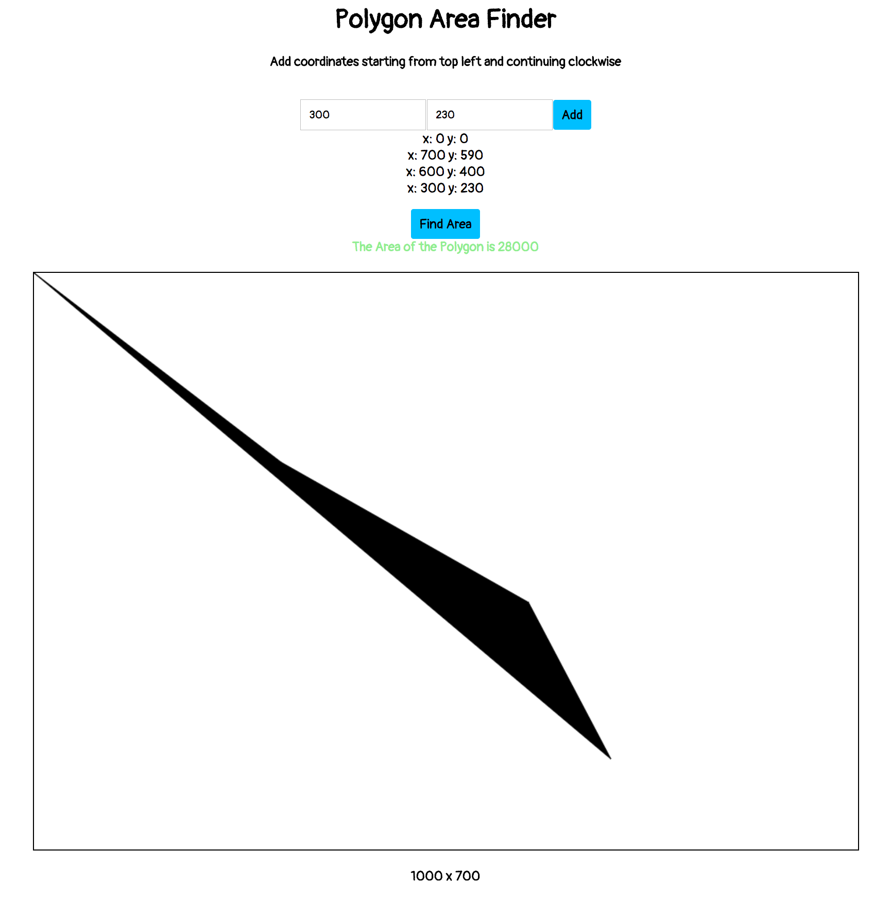

# Polygon Area Finder

Simple polygon area finder is made with React.js, JavaScript and Canvas




## Features
- Add coordinates to find the area of the polygon
- Visualize the polygon made by the user

##### Finding the area of the polygon
```JavaScript
if (coord.length > 2) {
  for (let i = 0; i < this.state.coordinates.length - 1; i++) {
    area += parseInt(coord[i]['x']) * parseInt(coord[i+1]['y']) - parseInt(coord[i+1]['x']) * parseInt(coord[i]['y']);
  }
  this.setState({
    area: Math.abs(area) / 2
  });
}
```

## Technology

  - React.js
    + Made very simple components to render
    + pure JavaScript without using any other libraries
  - HTML5 canvas
    + DOM manipulation and rendering
  - CSS3
    + Style and Reposition boxes in HTML
